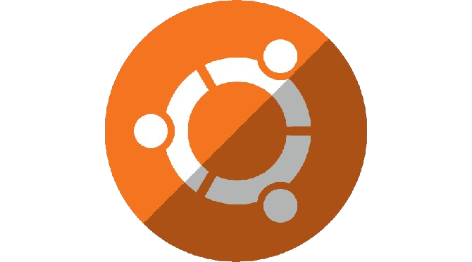

## Olá! 👋

#

  
🔭 Atualmente, estou trabalhando em:

  

  
🌱 Meu percurso na programação PHP:

  <ul>
    <li>Fundamentos da programação</li>
    <li><a href="https://github.com/BAD-WOLF/STUDIES/tree/master/procedural/claculator">Programação procedural básica</a></li>
    <li>Modularização e reutilização de código</li>
     
    <li>
      

        
Orientação a objetos:

        <ul>
          <li>Abstração</li>
          <li>Encapsulamento</li>
          <li>Herança</li>
          <li>Polimorfismo</li>
        </ul>
      

    </li>
    <li>
      

        
Freamework ( 𝑺𝒇. ):

        <ul>
          <li>Instalação e configuração do Symfony</li>
          <li>Desenvolvimento de aplicações web com Symfony</li>
          <li>Utilização de bundles e extensões</li>
          <li>Gestão de rotas e controladores</li>
          <li>Integração de templates Twig</li>
          <li>Autenticação e autorização</li>
          <li>Testes de unidade e funcionais</li>
        </ul>
      

    </li>
  </ul>

  
🛠️ Outras tecnologias e ferramentas:

  <ul>
    <li>
      

        
HTML/CSS:

        <ul>
          <li>Estruturação e estilização de páginas web</li>
          <li>Design responsivo</li>
        </ul>
      

    </li>
    <li>
    

      
Doctrine:

      <ul>
        <li>Mapeamento objeto-relacional (ORM)</li>
        <li>Configuração e utilização do Doctrine</li>
        <li>Entidades e relacionamentos</li>
        <li>Consulta e manipulação de dados com DQL</li>
        <li>Ciclo de vida das entidades</li>
        <li>Migrações de banco de dados</li>
        <li>Integração com Symfony</li>
      </ul>
    

    </li>
    <li>
      

        
Python:

        <ul>
          <li>Fundamentos da linguagem</li>
          <li>Estruturas de dados</li>
          <li>Programação orientada a objetos</li>
        </ul>
      

    </li>
    <li>
      

        
Docker:

        <ul>
          <li>Conceitos fundamentais de containers</li>
          <li>Criação e gerenciamento de containers</li>
        </ul>
      

    </li>
    <li>
      

        
MySQL:

        <ul>
          <li>Fundamentos do banco de dados MySQL</li>
          <li>Modelagem de dados relacionais</li>
          <li>Consulta e manipulação de dados</li>
          <li>Gestão de índices e otimização de consultas</li>
          <li>Utilização de transações e controle de concorrência</li>
          <li>Desenvolvimento de aplicações com MySQL</li>
        </ul>
      

    </li>
    <li>
      

        
C/C++:

        <ul>
          <li>Sintaxe básica e estruturas de controle</li>
          <li>Ponteiros e alocação dinâmica de memória</li>
          <li>Estruturas de dados e algoritmos básicos</li>
        </ul>
      

    </li>
    <li>
      

        
Git:

        <ul>
          <li>Controle de versão distribuído</li>
          <li>Repositórios locais e remotos</li>
          <li>
            

              
Utilização do GitFlow:

              <ul>
                <li>Branches principais (main/master e develop)</li>
                <li>Feature branches</li>
                <li>Release branches</li>
                <li>Hotfix branches</li>
                <li>Integração de branches</li>
                <li>Versionamento semântico</li>
                <li>Fluxo de trabalho colaborativo</li>
              </ul>
            

          </li>
        </ul>
      

    </li>
  </ul>

  
🧑‍💻 Experiência prática em:

  <ul>
    <li>Desenvolvimento web com HTML/CSS, JavaScript e PHP</li>
    <li>Desenvolvimento de aplicações Symfony</li>
    <li>Desenvolvimento de APIs RESTful</li>
    <li>Utilização de bancos de dados MySQL e relacionais</li>
    <li>Implementação de containers Docker para desenvolvimento e implantação</li>
    <li>Controle de versão com Git</li>
  </ul>

  
🧐 Conhecimento conceitual em:

  <ul>
    <li>Arquitetura de software</li>
    <li>Padrões de projeto</li>
    <li>Desenvolvimento ágil</li>
    <li>Testes de software</li>
  </ul>

<li>🤝 Procuro colaborar com outros desenvolvedores e ajudar consumidores com meus projetos.</li>

  
  

  
  
  
  
  
  
  
  
  
  
  
  
  
  
  
  

  
##

  
  
  
  
  

  

